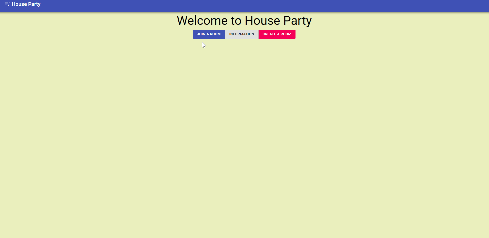

# House Party
Collaborative music playing system built with React and Django



## Structure

| Codebase             |      Description      |
| :------------------- | :-------------------: |
| [api](music_controller/api) | Django REST API  |
| [spotify](music_controller/spotify) | Spotify API      |
| [frontend](music_controller/frontend) | React frontend |


## Django REST backend

The Django REST backend is located within a Django app called `api`. With fetch calls from the frontend to the backend API (through the `api` URLs) we can create/read/update/delete room information. 

## React frontend

The React frontend is located within a Django app called `frontend`. Our project redirects any normal base URL to our `frontend/index.html` file (basically a Django template taken over by React) initially served through the `frontend/views.py` file. Afterwards, React Router handles how information is served and displayed to the client with various components.

## Spotify API


**Note:** within the `spotify` Django app, make your own `credentials.py` file with the following variables after making your own application at [Spotify's Developer Dashboard](https://developer.spotify.com/dashboard/).

```
SPOTIFY_CLIENTID = ""
SPOTIFY_CLIENTSECRET = ""
REDIRECT_URI = ""
```

The Spotify backend used to send requests to the Spotify API is located within a Django app called `spotify`. Overall here is a short explanation of how we use Spotify's API:
- User can authenticate our application to access their data with a certain scope

- After the user has logged in and granted authorization we obtain access/refresh tokens

- User access token is used to make requests to the Spotify API

- After one's access token has expired, we request a new one using the refresh token (stays constant) to continue interacting with the Spotify API
